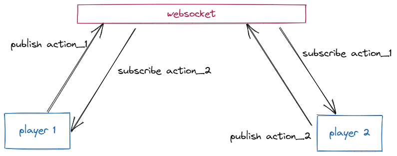

# MEMO

## Architecure globale

Le projet est un monorepo reposant sur une architecture websockets.

### Client 

La partie Front-End du projet écrite en Typescript avec la librairie ReactJs.
Le stockage des informations de la partie (playerId, couleur) s'effectue coté client dans le localStorage.

Chaque joueur éxecute la partie sur son navigateur du fait de peu de compléxité de calcul necessaire a l'éxecution du jeu.

On y retrouve des dossiers: 
- `/components` regroupe les composants utilisé pour construire l'application.
- `/context` defini de partager des informations au travers de l'application.
- `/shared` fonctions partagées utile à plusieurs
- `/pages` principales vues de l'application

### Domain

La couche métier defini la logique du jeu. Celle-ci est testé unitairement grace avec la librairie vitest.
Cette logique est éxecutée coté client.

- `/gamerules` defini toutes les regles du jeu.
- `/grid` contient les actions relatives à la grille.

### Server

La partie serveur repose sur la librairie Fastify qui permet de monter simplement un mini serveur web. Nous utilisons les websocket grace à la librairie `SokectIO`.

Ce choix s'explique du fait que les websockets permettent d'envoyer des évènements depuis un serveur vers un client (Server-Sent Events ou **SSE**).

De plus, la nature même du jeu (en ligne) impose que l'information doit se transmettre temps réel. Les informations et actions doivent être synchronisé entre les différents clients. Le serveur (ou le client) peut donc **publier** des évènements auxquels d'autres clients (ou serveurs) peuvent **souscrire** (**PubSub** pattern).  

