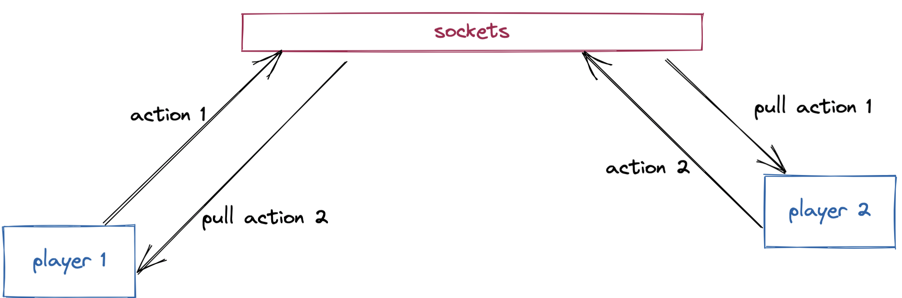

# MEMO

## Architecure globale

Le projet est un monorepo découpé en trois dossiers. Chacun épliquer ci-dessous.

### Client 

La partie Front-End du projet écrite en Typescript avec la librairie ReactJs.
Le stockage des informations de la partie s'effectue coté client dans le localStorage.
Chaque joueur éxecute la partie sur son navigateur du fait de peu de compléxité de calcul necessaire a l'éxecution du jeu.

On y retrouve des dossiers: 
- `/components` regroupe les composants utiliser pour construire l'application.
- `/context` defini de partager des informations au travers de l'application.
- `/pages` 

### Domain

La couche métier defini la logique du jeu. Celle-ci est testé unitairement grace avec la librairie vitest.
Cette logique est éxecutée coté client.

- `/gamerules` defini toutes les regles du jeu.
- `/grid` permet de creer la grille.

### Server

La partie serveur permet l'échange de données les entre les joueurs.Cela utilise un système de webscoket grace a librairie sokect.io.
Ce choix s'explique par la volonté de vouloir écouter les évenements d'un joueur en temps réel afin de les envoyer au joueur adverse.

